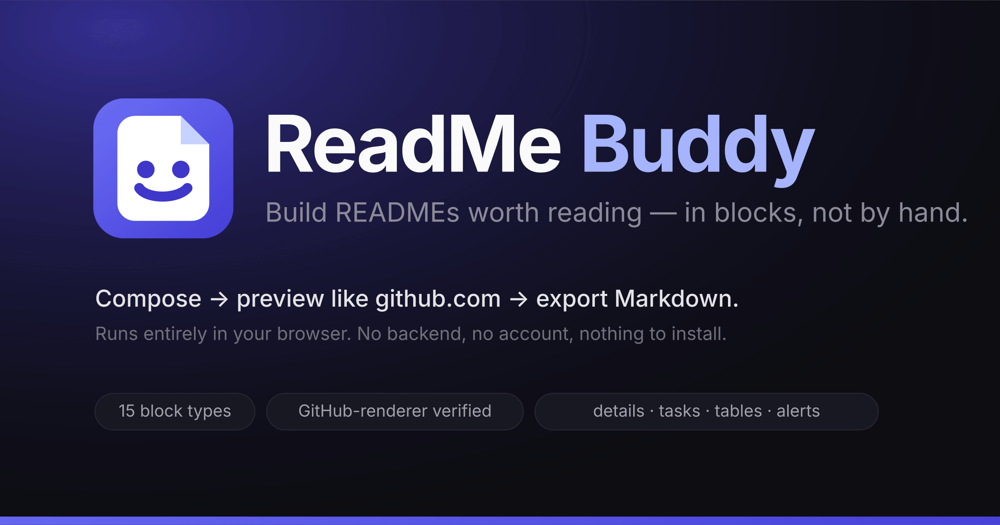

# ReadMe Buddy

<p align="center">
  
</p>

A visual GitHub README builder: compose blocks, choose how each section is
presented, preview it like github.com, export Markdown. Frontend-only — no backend,
no account, your document stays in your browser.

> **Status: Phases 1–2 are implemented** — the core builder and the GitHub Markdown
> engine. The rest of this document is the product roadmap they were built against.
> Stack rationale: [`docs/TECH-STACK.md`](docs/TECH-STACK.md).
>
> Renamed from *ReadMe Studio*; `localStorage` keys migrate on first load, so a
> document autosaved by the earlier build is picked up under the new namespace.

## Run it

```bash
npm install
npm run dev        # http://localhost:5173
npm test           # 167 tests (engine, golden fixture, store, preview fidelity, shell)
# GitHub's own renderer as an oracle (opt-in, needs network):
#   GFM_FIDELITY=1 npx vitest run src/engine/__tests__/github-fidelity.test.ts
npm run build      # static bundle → dist/  (host anywhere: GitHub Pages, Cloudflare Pages)
```

## What works today

- **15 block types** — Hero, Heading, Text, Features, Screenshot, Code, Table, Badges,
  Tech stack, Installation, Usage, License, Collapsible (`<details>`), Checklist
  (task lists), Links (buttons/pills/list) — each with its own property panel.
- **Canvas**: insert, drag-to-reorder (or `Alt+↑/↓`), duplicate (`⌘D`), hide/show (`H`),
  delete (`⌫`), and **undo/redo** (`⌘Z` / `⌘⇧Z`).
- **Layout choices, not just content**: hero alignment, five feature layouts
  (bullets / numbered / icon+text / 2-col cards / 3-col cards), four tech-stack layouts,
  per-column table alignment, GitHub alerts.
- **Live GitHub preview** (`github-markdown-css` + GFM + alerts + sanitized HTML),
  a **raw Markdown** view, and a **per-block Markdown peek** so you can see what each
  block contributes to the export.
- **Checks** tab: unbalanced fences, stray `</details>`, unescaped table pipes,
  unresolvable image paths, unknown alert types, duplicate section anchors, dropped
  URLs and Markdown pasted straight after `</summary>` are reported before you paste
  the result into a repo.
- **Escaping contract**: single-line label fields (headings, titles) are plain text
  and get Markdown-neutralised; multi-line bodies are Markdown and are never touched.
  `javascript:`/`data:`/control-character URLs are dropped, not escaped, and reported.
- **Fidelity, tested twice**: one rule file (`src/engine/__tests__/fidelity-rules.ts`)
  is asserted against our own preview *and* against `POST /api.github.com/markdown` —
  GitHub's renderer. 14 rules, both suites green.
- **Output**: Copy Markdown, Download `README.md` (`⌘S`), plus `.json` export/import.
  Autosave to `localStorage` so a refresh never loses work.

## Architecture in one line

```
Block (zod schema)  →  compile.ts (pure functions)  →  GitHub Flavored Markdown
                    ↘  react-markdown + github-markdown-css  →  preview
```

## Brand

`public/mark.svg` is the mark — a folded-corner page that smiles, i.e. a README that is
glad to see you. `logo.svg` / `logo-inverse.svg` are the lockups for light and dark
backgrounds, `og.svg` the social card. The PNGs are committed, so a build never needs a
rasteriser; after editing an SVG run `npm run brand:assets` (requires `sharp` — see the
header of `scripts/gen-brand-assets.mjs`).

`src/engine/**` never imports React. That single rule is what keeps the compiler
testable, keeps the Markdown correct, and keeps the door open on the roadmap's later
goal — the same engine driving CHANGELOG/CONTRIBUTING/API docs, or a CLI, or a
VS Code extension.

---

# Roadmap

Yes. I would structure this as a **product roadmap**, not just a coding roadmap, because the first job is to make sure we are not rebuilding readme.so.


Yes. I would structure this as a **product roadmap**, not just a coding roadmap, because the first job is to make sure we are not rebuilding readme.so.

I checked the current landscape. The important finding is that **basic visual README building is already occupied**: readme.so has section editing, drag-and-drop, live preview and download, while newer builders already offer blocks, badges, GitHub import, templates, AI and even GitHub commits. ([GitHub][1])

So our plan should deliberately move beyond "another README generator."

# 1. Product definition

I'd define the product as:

> **A visual GitHub README design studio where developers can compose, customize, preview and export GitHub READMEs without writing Markdown manually.**

The key word is **design**.

Not:

> "Generate my README."

But:

> **"Let me decide exactly what my README contains and how it is presented."**

---

# 2. Feature map

Let's divide the features into 6 groups.

| Area       | Feature                   | Priority |
| ---------- | ------------------------- | -------: |
| Builder    | Section/block builder     |   🔴 MVP |
| Builder    | Drag & drop ordering      |   🔴 MVP |
| Builder    | Custom sections           |   🔴 MVP |
| Builder    | Section duplication       |       🟡 |
| Builder    | Hide/show sections        |   🔴 MVP |
| Builder    | Nested sections           |       🟡 |
| Content    | Title & description       |       🔴 |
| Content    | Features                  |       🔴 |
| Content    | Installation              |       🔴 |
| Content    | Usage                     |       🔴 |
| Content    | Tech stack                |       🔴 |
| Content    | Screenshots               |       🔴 |
| Content    | API docs                  |       🟡 |
| Content    | Environment variables     |       🟡 |
| Content    | Roadmap                   |       🟡 |
| Content    | Contributing              |       🟡 |
| Content    | License                   |       🟡 |
| GitHub     | Badges                    |       🔴 |
| GitHub     | GitHub alerts             |       🟡 |
| GitHub     | Details/summary           |       🟡 |
| GitHub     | GitHub-style tables       |       🔴 |
| GitHub     | Code blocks               |       🔴 |
| GitHub     | Images                    |       🔴 |
| GitHub     | Links/buttons             |       🔴 |
| Preview    | Live GitHub-style preview |       🔴 |
| Preview    | Desktop/mobile preview    |       🟡 |
| Preview    | Raw Markdown view         |       🔴 |
| Export     | Copy Markdown             |       🔴 |
| Export     | Download README.md        |       🔴 |
| Import     | Import existing README.md |       🟡 |
| Import     | Import from GitHub URL    |       🟡 |
| Templates  | Project templates         |       🔴 |
| Templates  | Profile README templates  |       🟡 |
| Templates  | Save custom template      |       🟡 |
| Local      | LocalStorage projects     |       🟡 |
| Local      | Offline/PWA               |       🟢 |
| Design     | README themes             |       🟡 |
| Design     | Hero layouts              |       🟡 |
| Design     | Badge layouts             |       🟡 |
| Design     | Image layouts             |       🟡 |
| Design     | Feature-card layouts      |       🟡 |
| AI         | AI writing                |       🟢 |
| AI         | AI improvement            |       🟢 |
| GitHub API | Repository analysis       |       🟢 |
| GitHub API | Direct commit             |       🟢 |

🔴 = essential
🟡 = important later
🟢 = future differentiation

---

# 3. What existing products already do

This is important because we shouldn't blindly implement everything.

### readme.so

Already has:

* section selection
* section editing
* drag/drop
* many predefined sections
* custom section
* Markdown download
* live editor

Its GitHub repository currently has around **4.6k stars**. ([GitHub][1])

Therefore:

**Don't make readme.so v2.**

---

### New visual README builders

There are now builders offering:

* 15+ blocks
* live preview
* badge editor
* Markdown import
* GitHub repository README import
* templates
* profile README templates ([GitHub][2])

Another current builder goes even further:

* GitHub commit
* AI enhancement
* repository analysis
* local project management
* import/export
* badges
* social icons
* HTML/PDF/Word export ([GitHub][3])

So those aren't features we can claim as our unique selling point.

---

### AI README generators

AI tools already analyze:

* source code
* languages
* dependencies
* entry points
* tests
* CI
* Docker
* license

and generate READMEs from repositories. ([GitHub][4])

Therefore:

**AI generation should not be our Phase 1.**

---

# 4. Our differentiation

I would build around **three pillars**.

## Pillar 1 — Visual composition

Instead of just selecting sections:

```text
+ Add Section
```

we give users a visual composition system.

Example:

```text
README
│
├── Hero
│   ├── Logo
│   ├── Title
│   ├── Description
│   └── CTA buttons
│
├── Badges
│
├── Screenshot
│
├── Features
│   ├── Feature card
│   ├── Feature card
│   └── Feature card
│
├── Tech Stack
│
├── Installation
│
└── License
```

---

# 5. Pillar 2 — Design control

This is where I think your original idea has potential.

Give users choices like:

### Hero

```text
○ Centered
○ Left aligned
○ Logo + title
○ Terminal style
○ Minimal
○ Banner
```

### Features

```text
○ Bullet list
○ 2-column cards
○ 3-column cards
○ Icon + text
○ Numbered features
```

### Screenshots

```text
○ Single image
○ 2-column gallery
○ 3-column gallery
○ Image + description
```

### Tech stack

```text
○ Badges
○ Icons
○ Table
○ Grouped categories
```

The user isn't merely selecting **what** appears.

They're choosing **how it appears**.

That's the distinction.

---

# 6. Pillar 3 — GitHub correctness

This is something we should take seriously.

The user designs visually:

```text
Visual design
      ↓
Internal document model
      ↓
Markdown generator
      ↓
GitHub Flavored Markdown
```

The generated Markdown must remain valid.

We should support GitHub-specific syntax such as:

* GFM tables
* alerts
* task lists
* fenced code
* HTML where appropriate
* `<details>`
* images
* links
* badges

GitHub itself confirms that profile READMEs support GitHub Flavored Markdown, images and GIFs. ([GitHub Docs][5])

---

# 7. Recommended development phases

Now the actual build plan.

## Phase 0 — Product architecture

**Goal:** Design the engine before UI.

Build:

```text
Document Model
       ↓
Block Schema
       ↓
Markdown Compiler
       ↓
Renderer
```

Define blocks:

```typescript
type Block =
  | HeroBlock
  | TextBlock
  | FeaturesBlock
  | ImageBlock
  | GalleryBlock
  | BadgeBlock
  | CodeBlock
  | TableBlock
  | TechStackBlock
  | InstallationBlock
  | RoadmapBlock
  | LicenseBlock;
```

This phase is extremely important.

**Do not start with 30 React components and hard-code everything.**

---

# Phase 1 — Core README builder

### Goal

A usable frontend-only product.

Build:

* application shell
* block sidebar
* canvas
* block insertion
* block deletion
* block editing
* block reordering
* duplicate block
* hide/show block
* basic undo/redo
* live preview

Initial blocks:

```text
Hero
Text
Heading
Features
Image
Code
Table
Badges
Tech Stack
Installation
Usage
License
```

### Output

```text
Copy Markdown
Download README.md
```

At the end of Phase 1:

**You have a real working README builder.**

---

# Phase 2 — GitHub Markdown engine

Now make the output excellent.

Implement:

* GFM tables
* alerts
* code fences
* links
* images
* `<details>`
* task lists
* badges
* HTML blocks
* escaping
* Markdown validation

Build:

```text
Block → Markdown compiler
```

and:

```text
Markdown → Preview
```

This is where the application becomes technically solid.

---

# Phase 3 — Templates

Now make it useful immediately.

Create templates such as:

### Project

* Minimal Project
* Professional Project
* Open Source Project
* SaaS
* CLI
* Library
* API
* AI/ML

### Profile

* Developer Profile
* Full Profile
* Minimal Profile
* Portfolio Profile

Templates should not be just Markdown files.

They should be **compositions of your blocks**.

```text
Template
   ↓
Block configuration
   ↓
Builder
```

---

# Phase 4 — Visual design system

This is the phase I'd consider your main differentiation.

Add:

### Hero designer

```text
Title
Subtitle
Logo
Image
Buttons
Alignment
Width
```

### Badge designer

```text
Label
Message
Style
Logo
Link
```

### Feature designer

```text
Icon
Title
Description
Layout
Columns
```

### Screenshot designer

```text
Single
2-column
3-column
Gallery
Image + text
```

### Tech stack designer

```text
Languages
Frameworks
Databases
Cloud
Tools
```

This turns the product from a **README editor** into a **README designer**.

---

# Phase 5 — Import existing README

Now allow:

```text
Upload README.md
```

Then:

```text
Markdown
   ↓
Parser
   ↓
Block detection
   ↓
Internal document model
   ↓
Visual builder
```

Also support:

```text
Paste Markdown
```

This is important because users don't always want to start from zero.

---

# Phase 6 — Local project system

Still no backend.

Use:

```text
localStorage
```

or preferably:

```text
IndexedDB
```

for larger projects.

Features:

```text
New README
Save
Duplicate
Rename
Delete
Autosave
Version history
```

Example:

```text
My Projects

┌──────────────────────────┐
│ 🚀 SaaS Project          │
│ Updated 2 hours ago      │
└──────────────────────────┘

┌──────────────────────────┐
│ 🤖 AI Project            │
│ Updated yesterday        │
└──────────────────────────┘
```

---

# Phase 7 — GitHub integration

Only after the frontend product is good.

Add:

### Import

```text
GitHub URL
     ↓
Repository
     ↓
README
```

### Repository analysis

Detect:

```text
package.json
requirements.txt
pom.xml
Dockerfile
LICENSE
.env.example
src/
```

Then suggest:

```text
Detected:

React
TypeScript
Vite
Node.js
PostgreSQL
Docker

Suggested sections:

✓ Features
✓ Installation
✓ Environment Variables
✓ Development
✓ Deployment
```

This becomes much more valuable than manually filling forms.

---

# Phase 8 — GitHub publishing

Optional account connection.

```text
Connect GitHub
      ↓
Select repository
      ↓
Preview changes
      ↓
Commit README.md
```

This should come **late**, because authentication, permissions and GitHub API handling add complexity.

---

# Phase 9 — AI

Only now.

AI features:

### Generate

> "Describe your project."

→ Generate description.

### Improve

> Improve this section.

### Analyze

> Analyze my repository.

### Suggest

> What sections are missing?

### Rewrite

> Make this README more professional.

AI becomes an **assistant inside the designer**, rather than the entire product.

---

# Phase 10 — PWA / polish

Finally:

* PWA
* offline mode
* keyboard shortcuts
* responsive UI
* accessibility
* autosave
* export
* onboarding
* command palette
* dark/light mode
* performance optimization
* SEO landing pages

Because the core is client-side, this can remain extremely cheap to host.

---

# 8. Final architecture

I'd aim for this:

```text
                      README BUDDY
                          │
             ┌────────────┴────────────┐
             │                         │
        Visual Builder              Templates
             │                         │
             └────────────┬────────────┘
                          │
                    Document Model
                          │
             ┌────────────┴────────────┐
             ↓                         ↓
      Markdown Compiler          Live Renderer
             ↓                         ↓
       README.md                 GitHub Preview
             │
      ┌──────┴───────┐
      ↓              ↓
   Clipboard       Download
```

Later:

```text
                    GitHub
                      ↑
                      │
               GitHub Integration
                      │
README Buddy ─────────┤
                      │
                 Repository
                  Analysis
                      │
                     AI
```

---

# 9. What I would NOT build initially

This is equally important.

Don't start with:

❌ Authentication
❌ Database
❌ Payments
❌ AI API
❌ GitHub OAuth
❌ GitHub commits
❌ Team collaboration
❌ SaaS dashboard
❌ Backend
❌ Complex analytics

Your first version should literally be:

```text
Browser
  ↓
README Builder
  ↓
Markdown
```

That's it.

---

# 10. MVP scope

I'd make **Phase 1–3 your MVP**.

### MVP v1

**Builder**

* Add blocks
* Edit blocks
* Delete blocks
* Drag/drop
* Duplicate
* Hide/show
* Undo/redo

**Blocks**

* Hero
* Text
* Heading
* Features
* Badges
* Tech stack
* Image
* Gallery
* Code
* Table
* Installation
* Usage
* Roadmap
* License

**Preview**

* GitHub-style rendering
* Markdown source view

**Export**

* Copy Markdown
* Download README.md

**Templates**

* 8–10 templates

**Storage**

* Browser autosave

**No backend.**

---

# 11. Then your product evolution looks like this

```text
                V1
                 │
        README Builder
                 │
                 ↓
                V2
                 │
       README Designer
                 │
                 ↓
                V3
                 │
    Import + Repository Analysis
                 │
                 ↓
                V4
                 │
        GitHub Integration
                 │
                 ↓
                V5
                 │
         AI Documentation
                 │
                 ↓
                V6
                 │
       Full Documentation Studio
```

And **V6** is where this can become substantially bigger than a README generator:

> README + CHANGELOG + CONTRIBUTING + API docs + architecture docs + repository documentation.

That direction is much more defensible.

### My recommendation

**Start it.** But don't call the project "README Generator" in your product thinking.

Build **the visual document engine first**, then make README the first document type.

That architecture gives you an escape route from the crowded README-generator market rather than locking you into it.

[1]: https://github.com/octokatherine/readme.so?utm_source=chatgpt.com "GitHub - octokatherine/readme.so: An online drag-and-drop editor to easily build READMEs · GitHub"
[2]: https://github.com/ofershap/readme-builder?utm_source=chatgpt.com "GitHub - ofershap/readme-builder: Visual drag-and-drop README editor with live GitHub-flavored preview. SEO-optimized templates, 15+ block types, import/export markdown. · GitHub"
[3]: https://github.com/Readmecodegen/github-readme-builder?utm_source=chatgpt.com "GitHub - Readmecodegen/github-readme-builder: Create professional GitHub READMEs using our free AI-powered automatic readme files generator tool.Simply drag-and-drop sections, live markdown preview, GitHub profile readme templates and create standard readme.A tool that … scans your project, understands the codebase, and generates a detailed README with installation steps. · GitHub"
[4]: https://github.com/youmengde/readme-ai?utm_source=chatgpt.com "GitHub - youmengde/readme-ai: AI-powered README generator that analyzes repositories and creates practical documentation · GitHub"
[5]: https://docs.github.com/en/account-and-profile/concepts/personal-profile?utm_source=chatgpt.com "About your profile - GitHub Docs"

